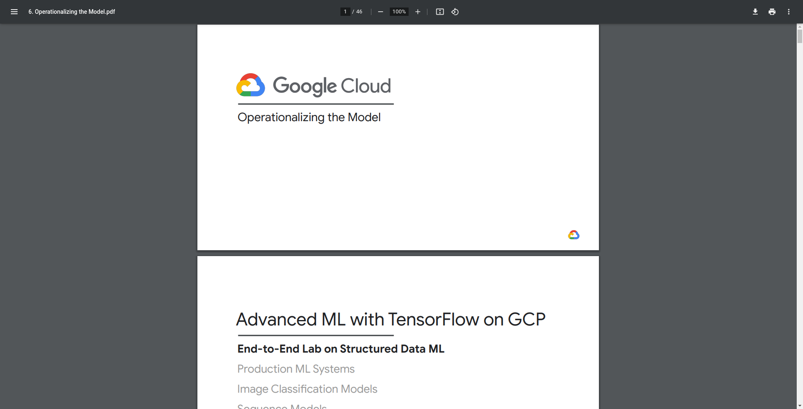

# MachineLearning-GoogleCloud

This app predicts using Machine Learning algorithms the weight of a baby given
pre-born conditions (mother's age, gender, gestation weeks, etc). This end to end
Machine Learning project is developed with Python and Tensorflow 2.x and scaled
with Google Cloud Platform using several powerful technologies such as BigQuery,
AI Notebooks and Cloud Dataflow.

